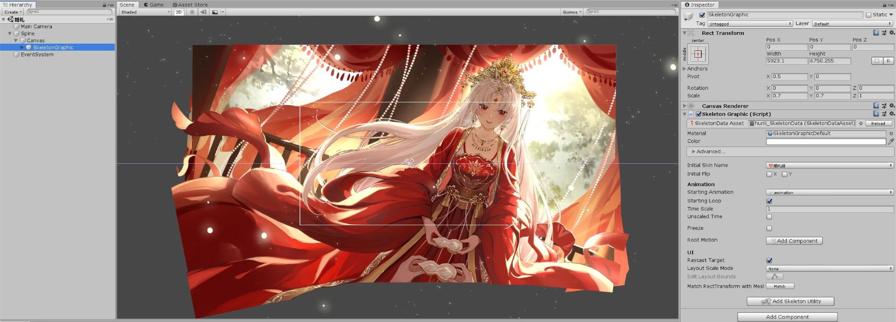

# CG管理器

## 简介

提供了额外的 CG 背景显示功能，同时支持静态CG与动态CG。

## 目录

- [静态CG](#静态cg)
    + [静态CG资源加载](#静态cg资源加载)
    + [静态CG调用方法](#静态cg调用方法)
- [动态CG](#动态cg)
    + [动态CG资源加载](#动态cg资源加载)
    + [动态CG调用方法](#动态cg调用方法)
    + [动态CG注意事项](#动态cg注意事项)
- [CG管理器功能介绍](#cg管理器功能介绍)

## 静态CG

JTools 提供的静态CG加载方式，与 Next 框架所提供的 CG 显示并无本质区别，但是细节实现上有所不同。

首先是面向 C# 用户，提供了直接提供 Sprite 数据的方式实现 CG 显示。

其次在CG显示的层级上，将CG背景放在了更高的层级上，能够遮盖住游戏除对话外的全部元素。

### 静态CG资源加载

将对应的静态资源存放到觅长生的指定路径内即可，或者直接存放到 Next 配置下的 /Assets/CG 文件夹内，由 Next 框架代为加载。

或者通过 AssetBundle 的资源载入方式，将CG文件存放在 Unity 资源目录的 /Assets/CG 路径内。

> 如果通过 AssetBundle 的方式载入静态资源，也可以通过 AssetBundleManager.Inst.LoadAsset 方法来加载资源 
> 相关的使用说明请参考[AB 资源管理器](../AssetBundle/index.md)

### 静态CG调用方法

在游戏内，可以通过 CGManager.Inst.ShowCg CgManager.Inst.HideCg 方法来显示与隐藏静态CG。
同时还支持传递自定义事件，在CG切换时提供额外的事件处理。

- JTools 的CG管理器支持传递 Sprite 数据，你可以通过任意方式获取一个 Sprite 元素来显示在游戏界面上，也可以设置半透明或全透明的遮罩来实现一些特殊效果。

有关静态CG的相关方法，可以参考下文[CG管理器功能介绍](#cg管理器功能介绍)中的方法介绍。

> 同样的，也可以通过封装好的 Next 指令来便捷调用，相关 Next 指令的介绍请参考[Next 指令扩展](../Next/index.md#cg-相关指令)

## 动态CG

JTools 同时支持动态 Spine 类型的 CG 显示，可以在游戏内加载一个动态背景。

> 注：动态CG背景目前版本仅支持场景加载的方式，后续版本会补充静态加载 
> 但实际上，不论是场景模式还是静态加载模式，都不影响动态CG的正常使用。

### 动态CG资源加载

想要使用动态CG背景，首先需要准备对应的 Spine 动态背景图，然后将其打包成相应的 AssetBundle 数据。

#### Unity 动态场景制作

>
动态CG的制作方式和动态立绘的制作方式类似，这里也可以直接参考动态立绘的制作教程 [Spine 动态立绘管理器](../Spine/index.md#创建并调整数据)

[文件结构图](动态CG项目结构.png)

1. 在 Unity 编辑器中，创建一个独立的CG场景，这里建议以CG名称来对场景命名。
2. 在场景内创建一个空的 GameObject 对象，同时将其以CG名称来命名，用以控制背景画幅。
3. 在 GameObject 对象上创建一个 Canvas 对象，用于画面显示，同时将其 RenderMode 改成 Screen Space-Camera 再将场景默认的
   Camera 绑定上去。
4. 在 Canvas 组件上创建一个 SkeletonGraphic 对象，将动态 Spine 数据挂载上去，修改相关的参数以适应画面显示。
5. 至此，一个动态的 Spine 立绘场景制作完成。

#### Unity 动态场景导出

这里和导出动态立绘不同的是，不再需要将CG压制成预制体，而是直接将当前场景打包。这样做的好处是你可以将多个CG场景打包到一起，同时还能复用一些资源来节约空间。

将打包后的场景 AssetBundle 数据存放到任意路径，通过[AB 资源管理器](../AssetBundle/index.md)
中的相关方法将场景资源加载到游戏中，即可正常调用动态CG背景了。

同样的，动态CG的 AssetBundle 资源也有一个推荐的默认存放路径，还请尽可能参照此路径存放数据。

默认存放路径: **SteamId(Mod名称)/plugins/AssetBundle/CG/**

### 动态CG调用方法

在游戏内，可以通过 CGManager.Inst.ShowSpineCg CgManager.Inst.HideSpineCg 方法来显示与隐藏静态CG。
同时还支持传递自定义事件，在CG切换时提供额外的事件处理。

> 同样的，也可以通过封装好的 Next 指令来便捷调用，相关 Next 指令的介绍请参考[Next 指令扩展](../Next/index.md#cg-相关指令)

### 动态CG注意事项

因为目前动态CG的实现方式是场景切换，因此CG本事是一个独立场景，这种处理方式能够优化动态CG的资源占用，但同样也会带来一些问题。

- 动态CG在关闭时，JTools 会将场景切换为最初的场景，但是对于某些特殊的场景切换回去可能会存在问题(如天魔谷战场，海上)
  ，因此使用动态CG时要注意当前所在场景。
- 场景切换会中断一些事件的处理，尤其是原版剧情的调用。关于这点 JTools 已经做了一些额外的处理，对基于 Next
  框架的剧情处理方式都是能够完美兼容的。
- 多个动态CG快速反复切换时，可能会因为资源占用过大导致加载缓慢、加载中断等情况，为此 JTools
  设置了一个延迟时间，在CG切换后会有一个0.6s的延时，用于加载等待及其他框架的一些数据处理。

尽管动态CG的场景切换存在一些弊端，但是也有其独到的优势，这里还是很推荐大家在了解 Unity 的场景特点后使用。

- 动态CG场景是支持叠甲的，你可以将多个场景元素以附加渲染的方式叠在一起，以实现一些特殊的画面效果

> 当然，您也可以将场景背景和场景环境分开，将一个背景元素和多个环境元素制作成多个CG素材，然后通过场景叠甲的方式，就可以很简单的复用背景替换环境了

- 场景自身是一个独立的数据，独立加载意味着你可以将场景相关的剧情、事件、玩法和动态场景直接结合到一起，这样场景切换的同时即可自动调用内置的相关内容，资源整合更加紧密。
- 觅长生官方设计中，对于场景有一些额外的配置项和处理，通过添加对应的配置信息，可以让你的动态CG场景更加真实，契合游戏。

## CG管理器功能介绍

| 方法体                                                                         | 参数介绍                                                           | 返回值  | 方法说明                                                                                                        |
|-----------------------------------------------------------------------------|----------------------------------------------------------------|------|-------------------------------------------------------------------------------------------------------------|
| ShowCg(string path, Action action = null)                                   | path sprite 资源存放路径 action 显示CG后的事件回调                       | void | 通过提供资源路径，显示静态CG 资源路径需要满足觅长生官方的资源存放地址 若对应资源不存在则会显示白色背景                                               |
| ShowCg(Sprite sprite, Action action = null)                                 | sprite 资源数据 action 显示CG后的事件回调                              | void | 通过提供 Sprite 资源，显示静态CG 您可以通过任意方式加载或创建一个 Sprite 资源显示                                                      |
| ShowSpineCg(string spineName, string skinName = null, Action action = null) | spineName 动态立绘名称 skinName 动态立绘皮肤名称 action 显示动态立绘后的事件回调 | void | 通过提供动态CG场景名称和皮肤名称，实现动态CG场景的切换和显示 如果已经在 Unity 编辑器中配置了默认的皮肤，则皮肤名称可以不填写 如果当前正在显示静态CG，则动态CG显示后会自动关闭静态CG |
| HideCg(Action action = null)                                                | action 隐藏CG后的事件回调                                              | void | 隐藏当前显示的静态CG                                                                                                 |
| HideSpineCg(Action action = null)                                           | action 隐藏CG后的事件回调                                              | void | 退出动态CG场景，回到最初的场景中                                                                                           |
