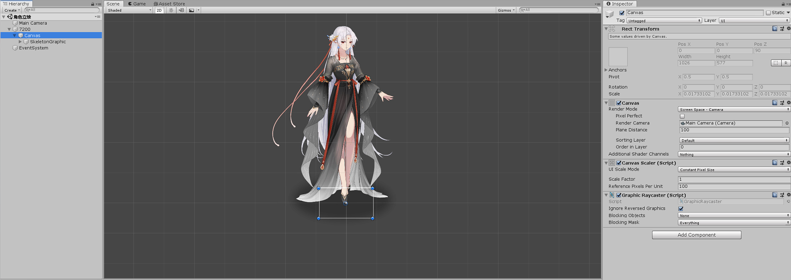
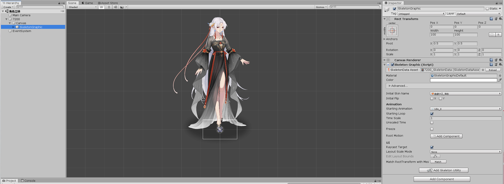

# Spine 动态立绘管理器

## 简介

因为现有的 NMC 动态立绘和埋久的动态立绘都是基于觅长生原版 Skeleton 进行的替换，而针对某些特性的情景，觅长生原版 Skeleton
是无法实现需求的。

因此 JTools 提供了一套额外的 Spine 立绘加载方案，完全摒弃了原版 Skeleton 数据结构，转而采用 SkeletonGraphic 对象，在 UI
层面进行显示处理。

同时也参照 NMC 的配置模式，提供了更为细致化的基于皮肤的自定义配置方案，以满足定制化的需求。

## 目录

- [Unity 中资源设置](#unity-中资源设置)
    + [创建并调整数据](#创建并调整数据)
    + [导出预制体数据](#导出预制体数据)
- [AB 数据存放及导入](#ab-数据存放及导入)
    + [数据导入方式](#数据导入方式)
    + [Spine 配置文件](#spine-配置文件)
    + [Spine 配置文件说明](#spine-配置文件说明)
- [Spine 管理器功能介绍](#spine-管理器功能介绍)

## Unity 中资源设置

为了适配觅长生游戏的各处不同的 Spine 显示模式，对于 Spine 立绘资源不能简单的通过导出 SkeletonAnimation 数据来实现立绘加载。同时也因为使用
SkeletonGraphic 在 UI 层面加载，因此在 Unity 编辑器中需要创建特定的数据结构。

这里以 "魔道妖女-小江" 动态立绘举例。首先需要在 Unity 项目内创建如下层次的结构，然后将 Spine 数据绑定到 SkeletonGraphic
对象上面。

### 创建并调整数据

[文件结构图](小江_Canvas设置.png)



1. 其中项目所在的场景名称随意，因为动态立绘不同于动态CG，不是通过场景加载的，因此可以任意命名
2. 立绘数据的主体是一个空的 GameObject 对象，该对象用于控制角色定位，因此务必要创建该层。同时将其命名为角色id
3. 第二层的 Canvas 则是用于显示 SkeletonGraphic 数据的，保持默认命名即可，同时相关的配置参数如图片右边所示

> 当前需要注意的配置项是，RenderMode 务必改成 Screen Space-Camera 同时将场景默认的 Camera 绑定上去，否则可能会导致游戏内的画面显示异常

4. 在 Canvas 的内部创建一个 SkeletonGraphic 对象，将 Spine 数据绑定上去

> 可以通过在 Unity 资源界面右键，选择 Spine 选项的第三项来快捷创建，该对象的名称不做要求

[Skeleton设置图](小江_Skeleton设置.png)



- 其中 SkeletonGraphic 的默认大小比例如右上方所示，请务必选择中心基准 同时保持默认大小

> 因为 Spine 显示的特殊性，在 Unity 中显示的画面效果和游戏内是不符的，也不需要强行调整至对应画幅，保持默认效果即可<br/>
> 相关的定位以及画幅在 JTools 中已经做了处理，所以这里只要简单保持默认即可

5. 调整默认皮肤配置，选择初始动画，同时确保启用动画循环播放配置 (**Starting Loop**)

- 若您当前的 Spine 立绘出现层级混乱，或者与原始画面不符的情况，可能是你的 Spine 中启用了混合模式，或者是使用了非默认的材质，而
  Unity 没有默认帮你启用 Blend 模式，可以自行开启该功能

### 导出预制体数据

此时您已经完成了 Spine 数据的相关配置，可以将您的角色数据压制成预制体导出。

选中您修改后的角色编号的对象，以它为根节点创建预制体数据，同时确保将预制体数据也命名为角色编号，保持默认的参数将其打包即可。

将打包后的 AssetBundle 文件也修改为角色编号，同时不要保留文件后缀

> 注意 此时您总共进行了3处数据修改 AssetBundle 文件、预制体数据、Spine数据根节点 这三处命名是一致的，都为对应角色编号<br/>
> 这里的各个数据的用意是不同的，其中 AssetBundle 文件的名称用于匹配 Spine 的配置文件，用来自定义调整游戏内的画面显示<br/>
> 预制体数据的名称用于数据匹配，获取对应的 Spine 数据 (此处早期版本可以采用默认名称 Spine
> 命名，但是此名称在同时编辑多个立绘角色时会存在冲突，因此仍旧保留角色编号作为数据名称)<br/>
> 最后的 Spine 数据名称则是用于游戏内的数据匹配，区分不同的立绘角色

## AB 数据存放及导入

### 数据导入方式

> Spine 立绘的数据导入依赖 **AB 资源管理器** 来实现，如果您还不了解 JTools 的 **AB 资源管理器**
> 可以参考[AB资源管理器](../AssetBundle/index.md)内的相关介绍

正如 **AB 资源管理器** 中介绍的，您可以将 AssetBundle 资源存放到任意路径内，但是我仍旧建议您将其存放到推荐的*默认路径*
内，以防止和其他工具库的资源加载发生冲突。

默认存放路径: **SteamId(Mod名称)/plugins/AssetBundle/Avatar/**

将 AssetBundle 资源存放好后，即可通过 **AssetBundle.Inst.LoadAvatarSpine** 方法来进行加载,之后即可在游戏中看到替换后的效果了。

> 相关 AssetBundle 操作除了参考 [AB资源管理器](../AssetBundle/index.md)
> 外，还可参考 [Next指令扩展](../Next/index.md#assetbundle-相关指令) 中的 Spine 部分

### Spine 配置文件

如果您的游戏内的 Spine 立绘效果位置不准，或者您制作了其他体型的角色骨骼，则可以通过添加额外的配置文件，来对立绘进行自定义的调整。

自定义配置的粒度可以精细到特定 **Spine 数据**的特定**皮肤**的特定**应用场景**。

1. 在您的 Spine 相关的 AssetBundle 文件的所在路径内，创建一个与角色立绘同名的 json 文件 (
   无论您的AB资源是否使用默认路径，都需要将配置文件和AB资源放在同一个文件夹内)
2. 打开对应的 json 文件夹，该文件将完成对特定角色的所有配置调整
3. 按照如下范例，创建对应的配置文件结构，其中顶层配置为 [] 数组类型，内部的 Skin 字段则对应您 Spine 立绘数据的皮肤名称

> config.json 文件示例

```json
[
    {
        "Skin": "小小江",
        "SayDialog": {
            "OffsetX": 40,
            "OffsetY": 50,
            "Scale": 1
        },
        "Pop": {
            "OffsetX": 0,
            "OffsetY": 50,
            "Scale": 1
        },
        "Info": {
            "OffsetX": 20,
            "OffsetY": 50,
            "Scale": 1
        },
        "Shop": {
            "OffsetX": 0,
            "OffsetY": 40,
            "Scale": 0.9
        },
        "Auction": {
            "OffsetX": 0,
            "OffsetY": 50,
            "Scale": 1
        },
        "Left": {
            "OffsetX": 0,
            "OffsetY": 48,
            "Scale": 1
        },
        "Tao": {
            "OffsetX": 0,
            "OffsetY": 48,
            "Scale": 1
        },
        "FightPop": {
            "OffsetX": 0,
            "OffsetY": 50,
            "Scale": 1
        },
        "Fight": {
            "OffsetX": -20,
            "OffsetY": -30,
            "Scale": 1
        }
    }
]
```

### Spine 配置文件说明

因为一份配置文件对应的是整个 Spine 数据的所有子项配置，因此顶层为一个 [] 数组对象。后文所进行的讲解，仅针对其中的一个子项来进行说明

> 注：若您游戏内的 Spine 立绘没有问题，则不需要配置该文件，也不需要创建该文件<br/>
> 若您创建了该配置文件，请务必保证单个配置项的所有字段的完整性

- 配置项说明

| 配置项名称     | 配置项说明   | 应用场景                                                                                                                           |
|-----------|---------|--------------------------------------------------------------------------------------------------------------------------------|
| Skin      | 对应的皮肤名称 | 用于不同Skin皮肤的细节调整<br/>此配置提供了一个额外的名称 All，使用该名称可以对所有的Skin皮肤进行统一调整，而无需指定皮肤名称<br/>若您同时使用了All和skin名称，则对应的skin将采用独立配置，其余skin采用All的全局配置 |
| SayDialog | 对话框配置   | 用于角色交谈时的立绘显示                                                                                                                   |
| Pop       | 交互面板    | 用于角色交互时，交互面板中心的立绘显示                                                                                                            |
| Info      | 信息面板    | 用于角色探查时，详细信息左上方的立绘显示                                                                                                           |
| Shop      | 交易面板    | 用于角色交易时，角色背包右上方的小窗口立绘显示                                                                                                        |
| Auction   | 拍卖会面板   | 用于角色参加拍卖时，拍卖会小窗口的立绘显示                                                                                                          |
| Left      | 左侧列表    | 用于场景内角色展示时，左侧列表内的立绘显示<br/>该处由于觅长生的原版配置，会强制显示角色原本的(静态/动态)立绘 导致Spine动态立绘覆盖在其上<br/>如果大小合适是可以完整遮盖住的，如若大小配置不合适，可以尝试添加一个透明的角色静态立绘    |
| Tao       | 论道界面    | 用于角色论道时，上方的立绘显示                                                                                                                |
| FightPop  | 战斗准备界面  | 用于角色对战准备时，对战界面的立绘显示                                                                                                            |
| Fight     | 战斗界面    | 用于角色对战时，对战角色的立绘显示<br/>该处当前版本存在一些细节问题，角色立绘会遮挡住技能释放的特效，后续版本会进行修复                                                                 |

- 配置项数据说明

| 子项名称    | 子项说明   | 子项默认值 |
|---------|--------|-------|
| OffsetX | 横坐标偏移量 | 0.0   |
| OffsetY | 纵坐标偏移量 | 0.0   |
| scale   | 放缩比例   | 1.0   |

## Spine 管理器功能介绍

| 方法体                                                                                                                   | 参数介绍                                                                                                     | 返回值       | 方法说明                                                                                                                                     |
|-----------------------------------------------------------------------------------------------------------------------|----------------------------------------------------------------------------------------------------------|-----------|------------------------------------------------------------------------------------------------------------------------------------------|
| LoadSpine(AssetBundle assetBundle)                                                                                    | assetBundle ab资源数据                                                                                       | void      | 加载并预处理 Spine 数据<br/>该方法在 AssetBundleManger.Inst.LoadAvatarSpine 中内置，加载数据时会自动调用                                                           |
| LoadSpineConfig(FileInfo file)                                                                                        | file spine配置文件数据                                                                                         | void      | 加载 Spine 配置数据<br/>该方法在 AssetBundleManger.Inst.LoadAvatarSpine 中内置，加载数据时会自动调用                                                             |
| CheckSpine(int id)                                                                                                    | id 角色编号                                                                                                  | bool      | 验证是否存在 Spine 数据<br/>该方法会检测缓存中的 Spine 数据，仅当 Spine 数据通过 LoadSpine 方法加载时，才能通过该方法检测                                                          |
| GetSpineSkin(int id)                                                                                                  | id 角色编号                                                                                                  | string    | 获取当前 Spine 立绘的皮肤名称<br/>若当前 Spine 数据不存在，则会返回 string.Empty                                                                                 |
| ChangeSpineSkin(int id, string skin)                                                                                  | id 角色编号<br/>skin 皮肤名称                                                                                    | void      | 变更特定 Spine 数据的皮肤<br/>此方法仅会变更皮肤配置，具体的皮肤切换操作请参考 RefreshSkin 方法                                                                             |
| CreateSpine(int id, Transform parent, Transform clone,<br/>SpineConfigMode configMode, Action<Transform> init = null) | id 角色编号<br/>parent Spine 数据挂载项<br/>clone Spine 数据 Clone 项<br/>configMode Spine 配置模式<br/>init 额外的初始化配置i方法 | void      | Spine 立绘数据挂载显示的核心方法<br/>该方法为 JTools 的核心处理方法，不可对其进行更改<br/>该方法的相关用法说明及应用范例，请自行参考 SpinePatch 文件内的相关代码                                       |
| InitSpines(Transform parent, Transform clone)                                                                         | parent Spine 数据挂载项<br/>clone Spine 数据 Clone 项                                                            | Transform | CreateSpine 方法的内置方法，用于创建 Spines 立绘显示数据的工具方法<br/>该方法为 JTools 的核心处理方法，不可对其进行更改<br/>该方法的相关用法说明及应用范例，请自行参考 CreateSpine 及 SpinePatch 文件内的相关代码 |
| CloseAllSpines(Transform spines)                                                                                      | spines Spine 数据挂载项                                                                                       | void      | CreateSpine 方法的内置方法，会关闭当前所有 Spines 立绘显示<br/>该方法为 JTools 的核心处理方法，不可对其进行更改<br/>该方法的相关用法说明及应用范例，请自行参考 CreateSpine 的相关代码                     |
| RefreshSkin(string key, Transform spine)                                                                              | key 数据索引<br/>spine Spine 数据对象                                                                            | void      | 读取当前 Spine 数据的皮肤配置,刷新当前皮肤显示<br/>需要提供特定的 Spine 数据才可正常使用<br/>该方法的相关用法说明及应用范例，可参考 CreateSpine 的相关代码                                         |
| RefreshConfig(string key, Transform spine, SpineConfigMode configMode)                                                | key 数据索引<br/>spine Spine 数据对象<br/>configMode 配置模式                                                        | void      | 读取当前 Spine 数据的配置文件，刷新当前 Spine 的显示配置<br/>该方法的相关用法说明及应用范例，可参考 CreateSpine 的相关代码                                                            |
| Transform GetSkeletonGraphic(Transform spine)                                                                         | spine Spine 数据对象                                                                                         | Transform | 获取当前 Spine 数据内的 SkeletonGraphic 组件所在对象                                                                                                   |
